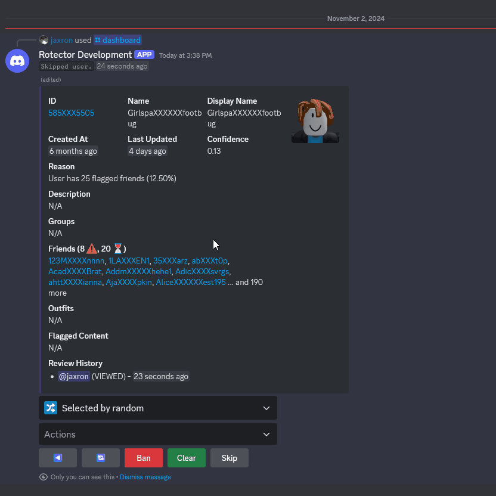
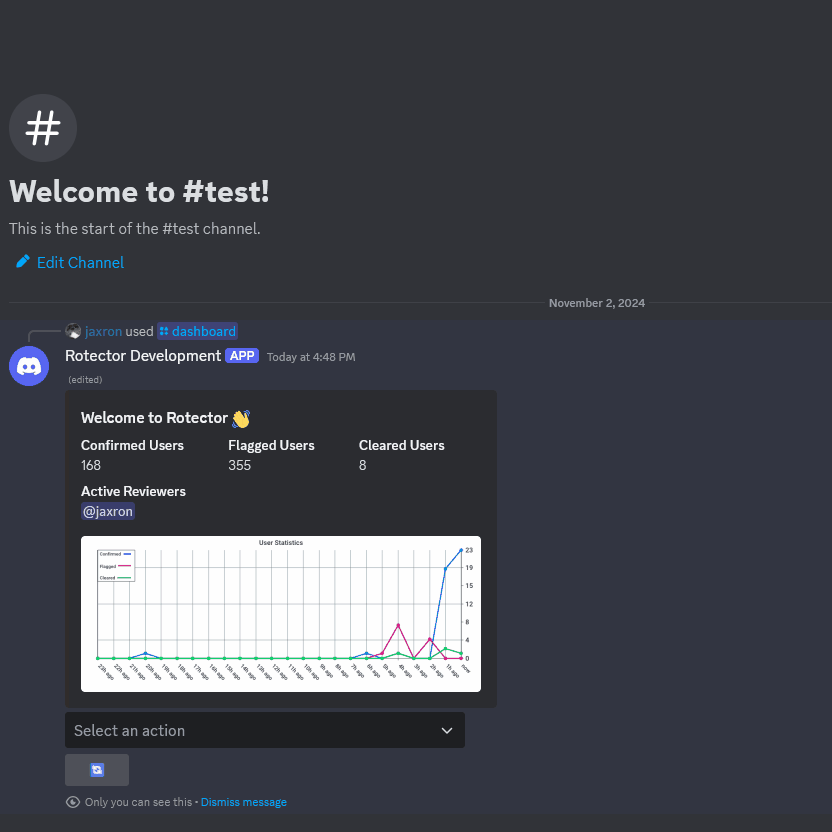
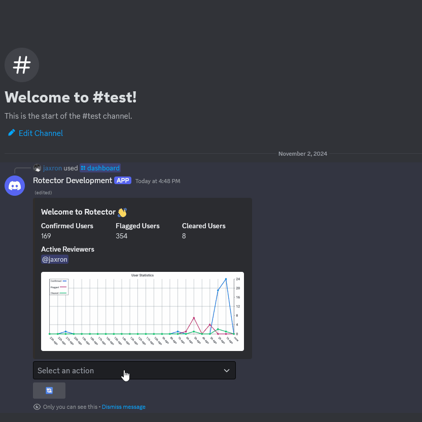
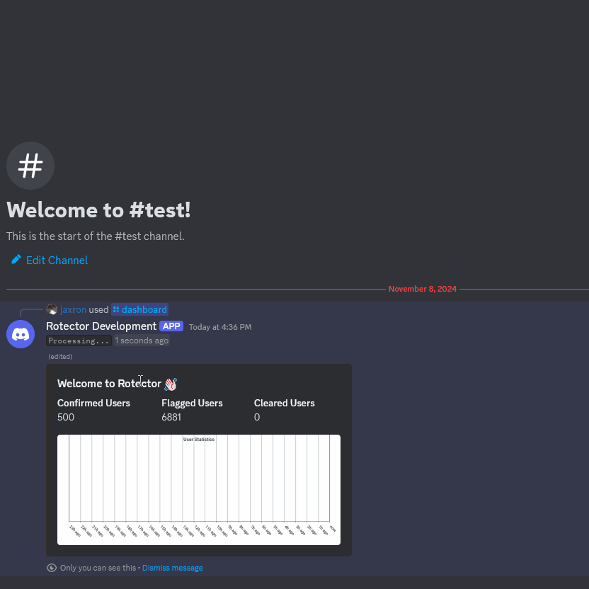
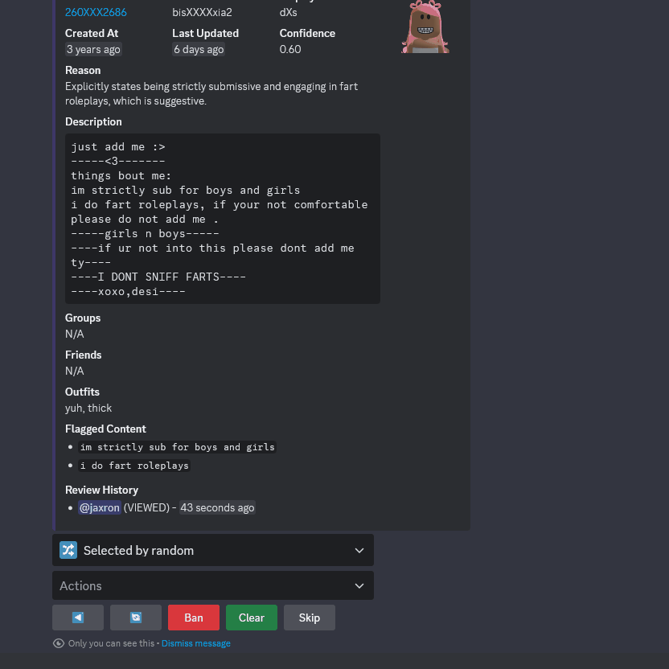
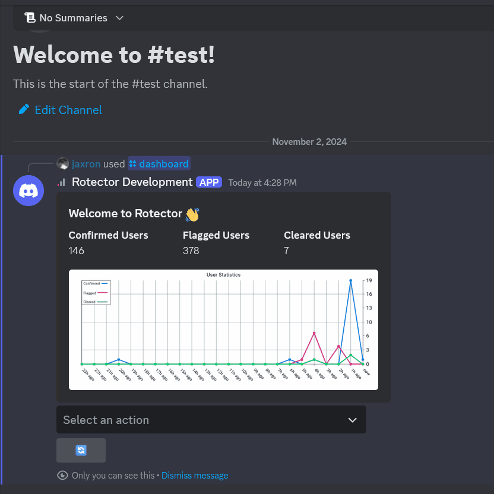
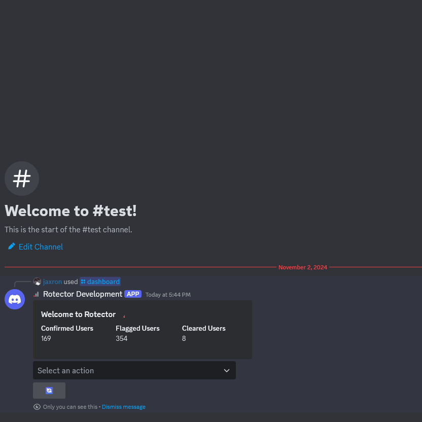
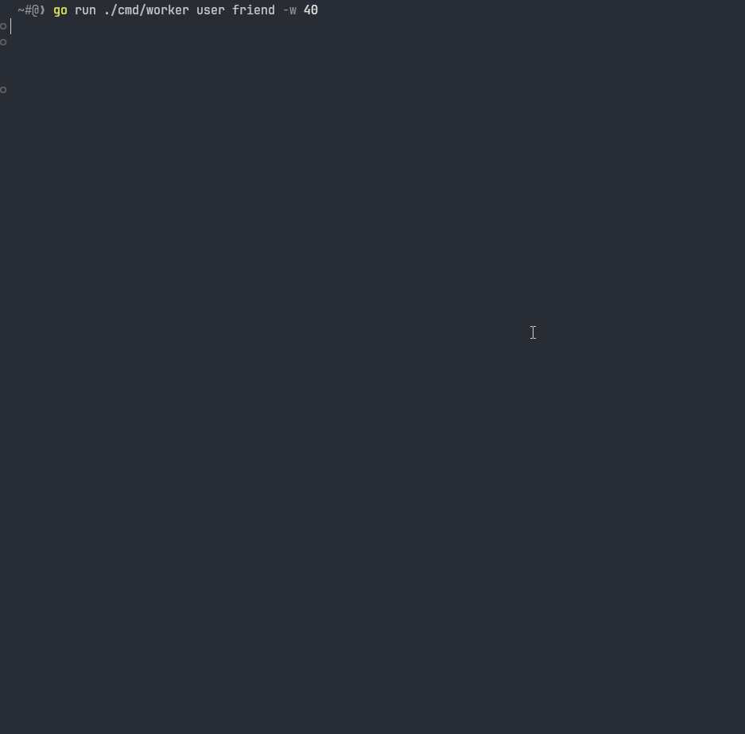

<h1 align="center">
  <picture>
    
  </picture>
   
  
  
  
  
</h1>

  <em>When Roblox moderators dream of superpowers, they dream of <b>Rotector</b>. A powerful application written in <a href="https://go.dev/">Go</a>, designed to assist in identifying inappropriate user accounts on Roblox using AI and smart algorithms.</em>
    
  🚀 <strong>An experimental project built with modern technologies.</strong>

---

> [!IMPORTANT]
> This project is currently in an **ALPHA** state with frequent breaking changes expected. Issues are currently disabled as the team focuses on implementing core features. This is a **community-driven initiative** and is not affiliated with, endorsed by, or sponsored by Roblox Corporation. More details in the [Disclaimer](#%EF%B8%8F-disclaimer) section.

---

## 📚 Table of Contents

- [🔍 Overview](#-overview)
- [🚀 Features](#-features)
- [📦 Prerequisites](#-prerequisites)
- [🎯 Accuracy](#-accuracy)
- [⚡ Efficiency](#-efficiency)
- [🛣️ Roadmap](#️-roadmap)
- [❓ FAQ](#-faq)
- [👥 Contributing](#-contributing)
- [📄 License](#-license)
- [⚠️ Disclaimer](#%EF%B8%8F-disclaimer)

## 🔍 Overview

|                                                                                                                                                 Swift AI Assisted Moderation                                                                                                                                                  |                                                                                                                                      In-Depth User Investigation                                                                                                                                       |
| :---------------------------------------------------------------------------------------------------------------------------------------------------------------------------------------------------------------------------------------------------------------------------------------------------------------------------: | :----------------------------------------------------------------------------------------------------------------------------------------------------------------------------------------------------------------------------------------------------------------------------------------------------: |
|                       

Review flagged accounts quickly with AI assistance. This system provides profile overviews and AI-generated violation reasons, allowing moderators to make informed decisions in seconds.
                       |       

The review menu also allows in-depth user investigation. Moderators can easily explore a user's outfits, friends, and groups, providing a detailed view for thorough and informed decision-making.
       |
|                                                                                                                                                         Streamer Mode                                                                                                                                                         |                                                                                                                                            User Log Browser                                                                                                                                            |
| 

Streamer mode provides additional privacy by censoring sensitive user information in the review menu. This feature is particularly useful for content creators and streamers who want to showcase the tool while maintaining privacy.
 | 

The log browser enables detailed querying of moderation actions. Administrators can search through logs based on specific users, actions, or date ranges, providing detailed audit trails. No more sabotaging!
 |
|                                                                                                                                                   Multi-format Translation                                                                                                                                                    |                                                                                                                                       Session State Preservation                                                                                                                                       |
|               

The review menu features comprehensive translation capabilities, supporting natural languages, morse code, and binary. This ensures effective review of content across different languages and encodings.
               |                                    

Review sessions are preserved across channels and servers, allowing moderators to seamlessly resume their work from where they left off.
                                    |
|                                                                                                                                                   Live Statistics Dashboard                                                                                                                                                   |                                                                                                                                         Priority Queue System                                                                                                                                          |
|                                                   

The dashboard displays live hourly statistics showing active reviewers and various statistics for real-time performance tracking.
                                                   |                        

Users can be added to priority queues for immediate processing. Workers automatically process these queues to check for potential violations using AI analysis.
                         |
|                                                                                                                                             Real-time Worker Progress Monitoring                                                                                                                                              |                                                                                                                                                                                                                                                                                                        |
|                   

Workers can be monitored in real-time to track progress directly from the terminal. Administrators can easily track the status and performance of various workers to ensure efficient operation.
                    |                                                                                                                                                                                                                                                                                                        |

## 🚀 Features

Rotector offers key features for efficient moderation:

- **AI-powered Analysis**

  - OpenAI integration for content analysis
  - High-accuracy detection of inappropriate profiles
  - Validation measures to prevent AI hallucination

- **Discord Review System**

  - Efficient review and action workflow
  - Overview of outfits, friends, groups
  - Streamer mode for content creators
  - Translation support (natural languages, morse code, binary)
  - Session state preservation

- **Worker System**

  - Multi-threaded parallel processing
  - Flexible command-line interface for worker management
  - Worker types:
    - AI Workers: Processes affiliations of flagged users or users in flagged groups
    - Purge Workers: Maintains database hygiene for old data and users
    - Queue Workers: Processes the queue of users to be checked by AI workers
    - Stats Worker: Uploads cached statistics to PostgreSQL daily

- **Priority Queue System**

  - Custom user ID queueing with priority levels
  - Automated AI analysis of queued users

- **Optimized Requests** ([axonet](https://github.com/jaxron/axonet) & [RoAPI.go](https://github.com/jaxron/roapi.go))

  - Fault-tolerant operations with [circuit breaker patterns](https://en.wikipedia.org/wiki/Circuit_breaker_design_pattern)
  - Retry mechanisms with [exponential backoff](https://en.wikipedia.org/wiki/Exponential_backoff)
  - Request deduplication through [single flight](https://pkg.go.dev/golang.org/x/sync/singleflight)
  - Rotatable proxy support to avoid rate limits
  - Response caching to reduce load on Roblox API

- **Detailed Logging**
  - Full audit trails and statistics
  - Real-time monitoring dashboard
  - Log files for operations and errors

## 📦 Prerequisites

> [!WARNING]
> This tool requires significant resources and technical expertise to run properly. It is not recommended for casual users without the necessary infrastructure.

### Essential

- [Go](https://go.dev/) 1.23.2
- [PostgreSQL](https://www.postgresql.org/) 17.0 (with [TimescaleDB](https://www.timescale.com/) 2.17.1 extension)
- [DragonflyDB](https://dragonflydb.io/) 1.24.0 or [Redis](https://redis.io/) 7.4.1
- OpenAI API key
- Discord Bot token

### Optional

- Proxies: For distributed requests and bypassing rate limits
- Cookies: Not necessary at this time

## 🎯 Accuracy

Rotector is designed to identify potentially inappropriate content while minimizing false positives. Here's an overview of its capabilities.

### Detection Capabilities

Rotector uses a conservative flagging approach to minimize false positives as the AI only raises flags when there is evidence of a violation, which means some borderline cases may be missed in favor of accuracy.

The AI friend worker stands as our most effective scanning method. It systematically goes through friend lists of flagged accounts which has proven particularly effective in uncovering hidden networks of inappropriate accounts.

To prevent AI hallucination, the system implements strict validation measures as all AI-generated content are cross-checked against actual user profile data, ensuring that flagged content actually exists.

> [!TIP]
> For detailed performance metrics and test results, see the [Efficiency](#-efficiency) section.

### What it Does Not Detect

To reduce false positives, Rotector is designed to avoid flagging:

Users solely based on their affiliations (friend/follower/following)

Affiliate-based flagging could unfairly target users who may have been added or followed unknowingly, or who connected with others before they became inappropriate accounts. Historical connections don't have enough context to determine current intent. However, if the account is found to be involved in a large network of inappropriate accounts, it will be flagged.

General mentions of friendship or relationships

Normal social interactions and platonic relationships are normal on the platform.

Non-sexual emojis or common internet slang

Many emojis and slang terms have multiple meanings and are commonly used innocently. Therefore, context is crucial, and flagging such content would lead to many false positives.

Artistic content without explicit sexual themes

Creative expression is a core part of the Roblox platform. Art should only be flagged when it clearly violates guidelines.

Discussions about gender identity or sexual orientation

These are legitimate parts of personal identity. Flagging such content could lead to discrimination and prevent users from expressing their authentic selves within platform guidelines.

References to non-sexual roleplaying games

Roleplaying is a popular and legitimate form of gameplay on Roblox. Only explicit adult or inappropriate roleplay scenarios would be flagged.

General profanity or non-sexual insults

These are better handled by existing chat filters and standard moderation tools. Focusing on these would affect the tool's primary purpose of detecting safety concerns.

## ⚡ Efficiency

Rotector is designed to be highly efficient in processing large volumes of data while maintaining reasonable resource usage. Below is a performance snapshot from one of our test runs (as of November 7, 2024).

> [!NOTE]
> These results are from a single test run and should be considered illustrative rather than definitive. Performance can vary significantly based on multiple factors like API response times, proxy performance, system resources, configuration, and more.

### Test Configuration

- Users to Scan: 500
- Workers: 3 AI friend workers
- Proxies: 250 Romanian Location
- Rate Limit: 200 requests/second

### Performance Metrics

| Metric                              | Value                 |
| ----------------------------------- | --------------------- |
| Time Taken                          | 44 minutes 32 seconds |
| **Accounts Flagged**                | **7,078**             |
| API Requests Sent                   | 74,243                |
| API Request Success Rate            | 99.86%                |
| Bandwidth Used                      | 753.48 MB             |
| OpenAI Token Cost                   | $0.16                 |
| OpenAI API Calls                    | 241                   |
| Redis Memory Usage                  | 803.92 MB             |
| Redis Key Count                     | 69,663                |
| Concurrent Goroutines (min/avg/max) | 335 / 2,428 / 4,454   |

> [!NOTE]
> At this rate, a 24-hour runtime would theoretically flag approximately **228,869 users** with AI costs of $5.17. However, the actual number of flagged users would likely decrease over time as more users are added to the database, since previously processed users would not need to be rechecked.

### Accuracy Validation

In a manual review of 100 randomly selected flagged users from this test run:

- 99 users were confirmed as correctly flagged
- 1 user was cleared due to insufficient profile information

## 🛣️ Roadmap

This roadmap shows our major upcoming features, but we've got even more in the works! We're always adding new features based on what the community suggests.

- 📊 **Dashboard Features**

  - Real-time worker status monitoring
  - More statistical overview

- 👥 **Moderation Tools**

  - Session transfer between moderators
  - Appeal process system
  - Group reviewing
  - Inventory inspection

- 🌟 **Community Review System**

  - Community members can vote flagged accounts
  - Reputation-based user review system
  - High vote count accounts are reviewed first

- 🔍 **Scanning Capabilities**

  - Group content detection (wall posts, names, descriptions)
  - Cryptographic content detection

- 🌐 **Public API** (Available in Beta)
  - REST API for developers to integrate with
  - Script for Roblox game developers to integrate with

## ❓ FAQ

What's the story behind Rotector?

Rotector began with its creator, [jaxron](https://github.com/jaxron), developing two foundational libraries on September 23, 2024: [RoAPI.go](https://github.com/jaxron/roapi.go) and [axonet](https://github.com/jaxron/axonet). These libraries became the backbone of Rotector's networking and API interaction capabilities.

Rotector's official development secretly started on October 13, 2024, driven by his personal concerns about the growing problem of inappropriate behavior and content on the Roblox platform, and with the ambitious goal to protect younger players from potential predators. The project was officially open-sourced for alpha testing on November 8, 2024.

While Roblox has its own moderation system, the platform's massive user base makes it difficult to quickly identify every inappropriate account. Some Roblox staff have also acknowledged the challenge of moderating users due to the high volume of reports. Even after being reported, inappropriate accounts—including those potentially belonging to predators—often remain active.

By automating the detection process, Rotector aims to simplify this process and enable quicker identification of potentially inappropriate accounts. We want to contribute to the current moderating efforts and give the Roblox community—especially its younger members—an extra level of security.

Why is Rotector open-sourced?

We believe in transparency and the power of open source. By making our code public, anyone can understand how the tool works. This project also serves as a learning resource for those interested in online safety and moderation technologies.

While we welcome feedback and suggestions, please note that this open-source release is primarily for informational and educational purposes.

Why don't you provide setup instructions for Rotector?

We deliberately don't provide detailed setup instructions for Rotector due to several important reasons:

1. **Complex Setup**: Setting up and maintaining Rotector is a complex process that requires professional expertise and is not designed for casual use or inexperienced users.

2. **Preventing Misuse**: We hope to prevent potential misuse of the tool. This is due to the fact that providing easy instructions could allow the very groups we're trying to combat (such as ERPers) to exploit or circumvent the system.

3. **Resource Intensiveness**: Rotector requires computational resources and infrastructure to run effectively, which may not be simple for individual users or small organizations.

If you represent a business, organization or you are a developer that needs to set up and use Rotector for legitimate purposes, please contact us directly.

When will the REST API be available?

The REST API will be available during beta phase. In the current alpha phase, the project is focused on core functionality including worker capabilities and the reviewing system. Once these foundational features are stable, we'll begin work on the public API that will allow developers to integrate Rotector's capabilities into their own applications.

Can I use Rotector without the Discord bot?

Although the Discord bot is essential for the easy review and moderation of detected accounts, Rotector's primary features (identifying and reporting accounts with workers) can function on their own. If you decide not to use the Discord bot, you would have to implement another method for reviewing detected accounts. This could involve directly querying the database or creating a custom interface for reviewing detected accounts.

Why use Discord instead of a custom web interface?

Discord's bot framework provides all the functionality needed for efficient review processes, including buttons, dropdowns, forms, and rich embeds. Using Discord also allows us to focus our development efforts on core features rather than spending time building and maintaining a custom frontend.

Are proxies and cookies necessary to use Rotector?

No, proxies and cookies are not required to use Rotector. Proxies can be helpful for distributed requests and avoiding rate limits when making many requests. However, while cookies are mentioned in the configuration, they are not currently used for anything in the project.

You can configure proxies in the `config.toml` file if needed. This configuration file also includes a rate limiter setting, which allows you to control the frequency of requests to the Roblox API.

Will users who have stopped their inappropriate behavior be removed from the database?

No, past rule violations remain in the database, even if a user claims that they have changed their ways. This can be useful for law enforcement investigations and for future safety concerns. Additionally, some users try to clean their reputation temporarily, only to resume their actions later.

This isn't about preventing forgiveness, but rather about maintaining accountability. The records serve as a crucial part of our ongoing efforts to keep the platform safe for all users, especially minors.

Who inspired the creation of Rotector?

[Ruben Sim](https://www.youtube.com/@RubenSim), a YouTuber and former game developer, helped inspire Rotector through his dedicated work exposing Roblox's moderation issues. His efforts running the [Moderation for Dummies](https://x.com/ModForDummies) Twitter account, which consistently posts verified ERP accounts, showed what dedicated individuals can achieve even without technical resources or official support. We are deeply grateful for his contributions which helped pave the way for our project.

How did "Rotector" get its name?

1. **Protector**: Aims to protect the Roblox community, especially younger players, from inappropriate content and potential predators.
2. **Detector**: Designed to detect and identify potentially inappropriate accounts on the platform.
3. **"Ro-" prefix**: Comes from "Roblox", the platform it's designed to work with.

## 👥 Contributing

We follow the [Contributor Covenant](CODE_OF_CONDUCT.md) Code of Conduct. If you're interested in contributing to this project, please abide by its terms.

If you're feeling extra supportive, you can always buy us a coffee! ☕

## 📄 License

This project is licensed under the GNU General Public License v2.0 - see the [LICENSE](LICENSE) file for details.

## ⚠️ Disclaimer

Roblox is a registered trademark of Roblox Corporation. "Rotector" and the Rotector logo are not affiliated with, endorsed by, or sponsored by Roblox Corporation.

Rotector is free software: you can redistribute it under the terms of the GNU General Public License version 2 as published by the Free Software Foundation. You may modify the software for your own use. If you distribute modified versions, you must do so under the same GPL v2 license and make the source code of your modifications available.

### Terms of Service Compliance

While Rotector only accesses publicly available information through Roblox's API, users should be aware that:

- This tool should not be used to harass or target specific users
- Any automated scanning and excessive requests may violate Roblox's Terms of Service
- Users are responsible for respecting the rate limit
