<h1 align="center">
  <picture>
    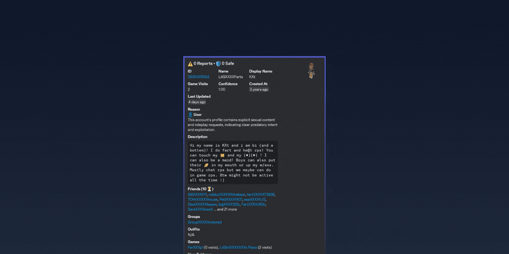
  </picture>
   
  
  
  
  
  
</h1>

  <em>When Roblox moderators dream of superpowers, they dream of <b>Rotector</b>. A powerful system built with <a href="https://go.dev/">Go</a> that uses AI and smart algorithms to find inappropriate Roblox accounts.</em>

---

> [!IMPORTANT]
> This project is currently in an **ALPHA** state with frequent breaking changes - **do not use this in production yet**. This is a **community-driven initiative** and is not affiliated with, endorsed by, or sponsored by Roblox Corporation. More details in the [Disclaimer](#%EF%B8%8F-disclaimer) section.

---

## 📚 Table of Contents

- [🚀 Features](#-features)
- [📦 Prerequisites](#-prerequisites)
- [📚 Guides](#-guides)
- [⚡ Efficiency](#-efficiency)
- [🛠️ Community Tools](#%EF%B8%8F-community-tools)
- [❓ FAQ](#-faq)
- [👥 Contributing](#-contributing)
- [📄 License](#-license)
- [⚠️ Disclaimer](#%EF%B8%8F-disclaimer)

## 🚀 Features

|                                                                                                                                                      Fast AI-Assisted Workflow                                                                                                                                                      |                                                                                                                                     In-Depth User Investigation                                                                                                                                     |
|:-----------------------------------------------------------------------------------------------------------------------------------------------------------------------------------------------------------------------------------------------------------------------------------------------------------------------------------:|:---------------------------------------------------------------------------------------------------------------------------------------------------------------------------------------------------------------------------------------------------------------------------------------------------:|
|                             
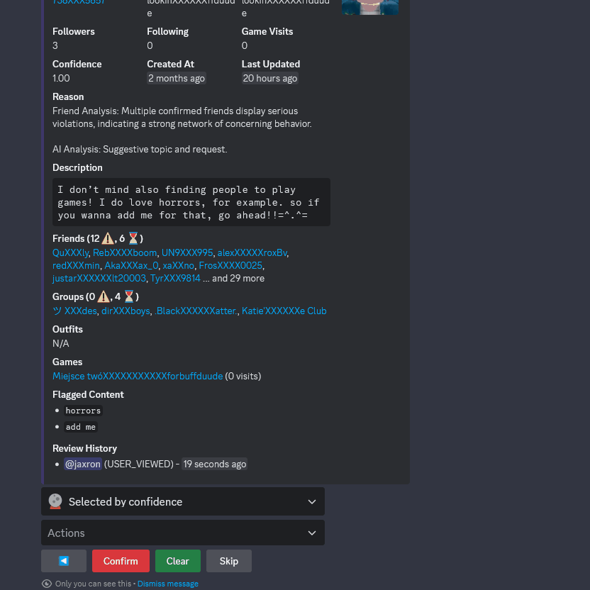

Easily review flagged accounts within seconds with the help of AI and an overview of profile details and violations, helping moderators make smart decisions.
                              |                              
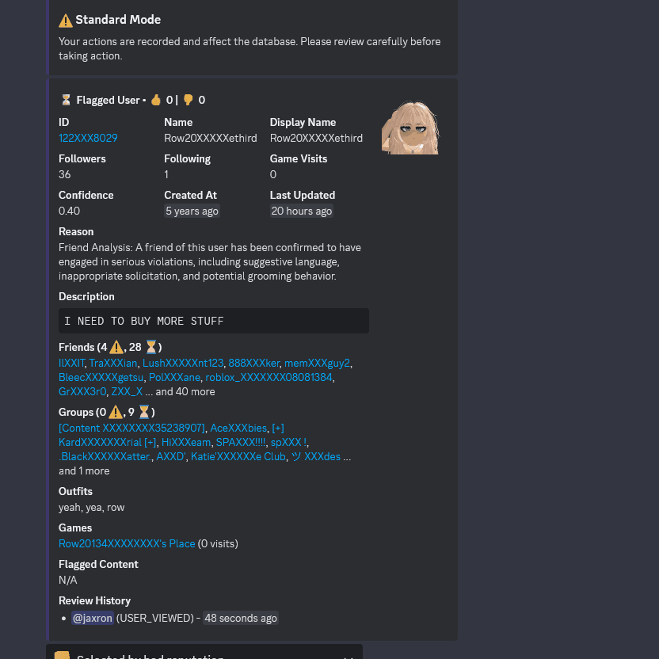

Moderators can easily explore a user's outfits, friends, and groups, providing an understanding of the user's activity.
                              |
|                                                                                                                                                      Multi-Format Translation                                                                                                                                                       |                                                                                                                                        Activity Log Browser                                                                                                                                         |
|           
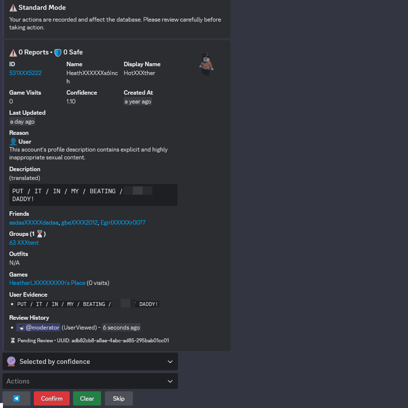

The review menu features translation capabilities, supporting natural languages, morse code, and binary, which ensures effective review of content across different languages and encodings.
           |      
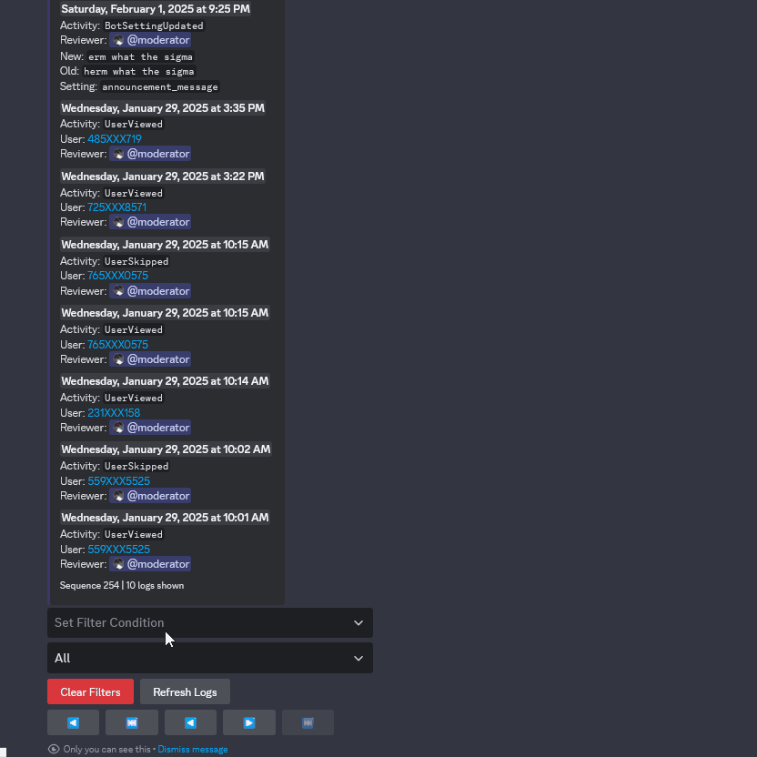

The log browser allows administrators to make detailed queries of moderation actions based on specific users, actions, or date ranges, which provides detailed audit trails.
      |
|                                                                                                                                                            Streamer Mode                                                                                                                                                            |                                                                                                                                     Session State Preservation                                                                                                                                      |
|              
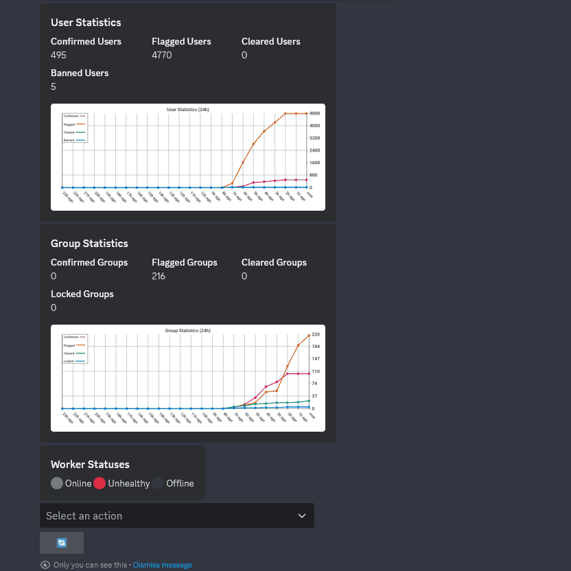

Streamer mode provides additional privacy by censoring sensitive user information in the review menu. This feature is particularly useful to prevent confidential information being exposed.
              | 

With our modern infrastructure, review sessions are preserved globally across channels and servers, allowing moderators to seamlessly resume their work from where they left off.
 |
|                                                                                                                                                            Training Mode                                                                                                                                                            |                                                                                                                                            Review Modes                                                                                                                                             |
|            
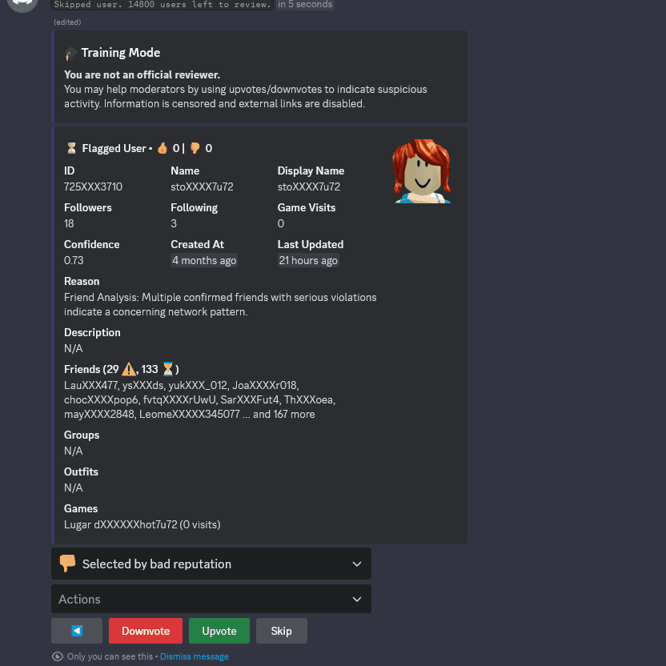

Non-official moderators in the community can participate by upvoting/downvoting based on whether they think an account breaks the rules, helping to point out accounts that need urgent review.
             |              
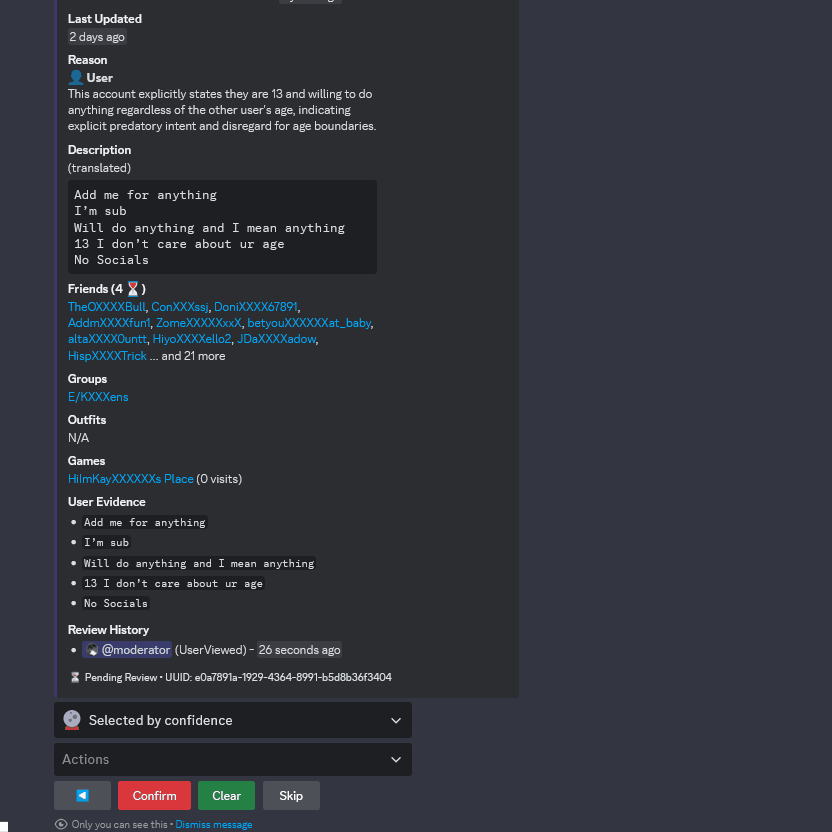

Moderators can switch between Standard Mode (ban/clear) and Review mode (report/safe), and also switch between reviewing Flagged, Confirmed and Cleared users.
              |
|                                                                                                                                                       AI Moderation Assistant                                                                                                                                                       |                                                                                                                                            Recheck Users                                                                                                                                            |
|                                           
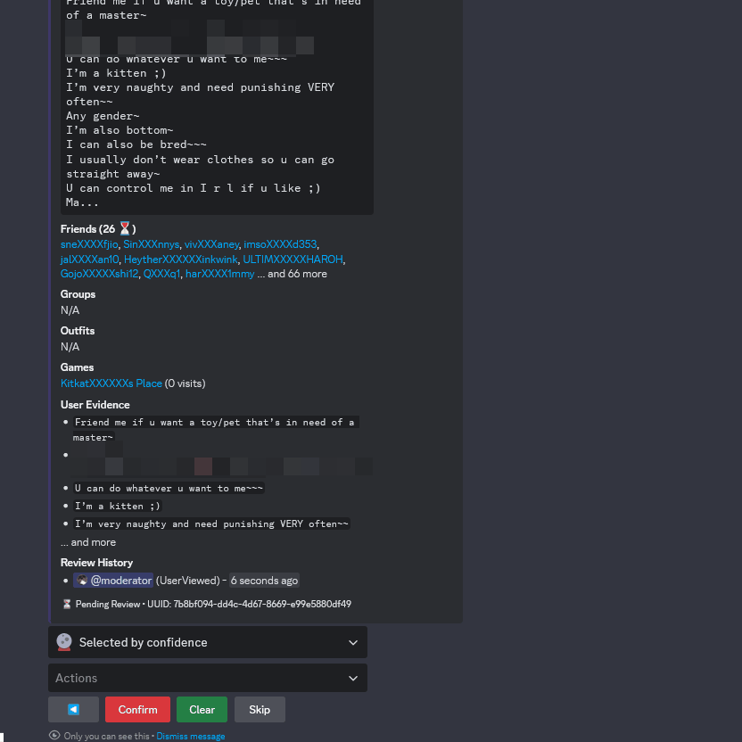

Moderators can use an AI assistant to get guidance on moderation decisions, analyze user behavior patterns, and receive recommendations.
                                           |                                      
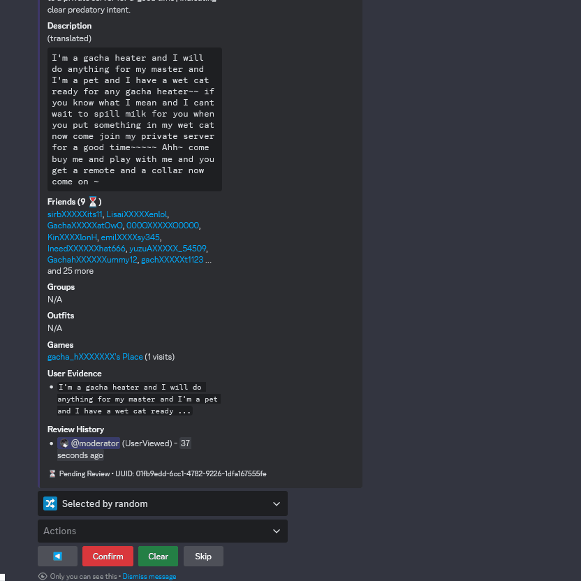

Users can be rechecked if analysis is wrong or the user information is outdated right from the review menu.
                                       |
|                                                                                                                                                            Appeal System                                                                                                                                                            |                                                                                                                                          User/Group Lookup                                                                                                                                          |
| 
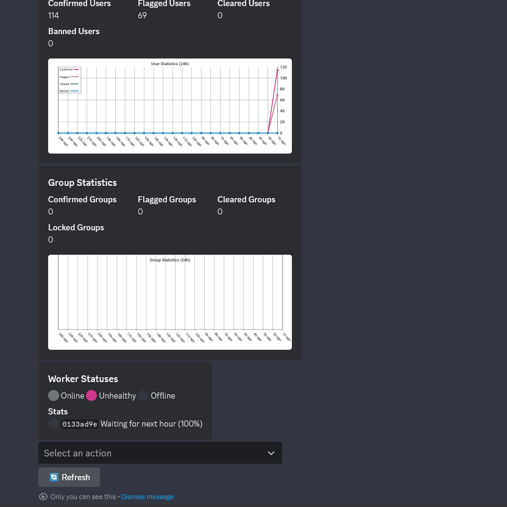

Users can appeal flagged accounts through an intuitive ticket system. The automated verification process ensures legitimate appeals, and moderators can efficiently process appeals with simple accept/reject actions.
 |                
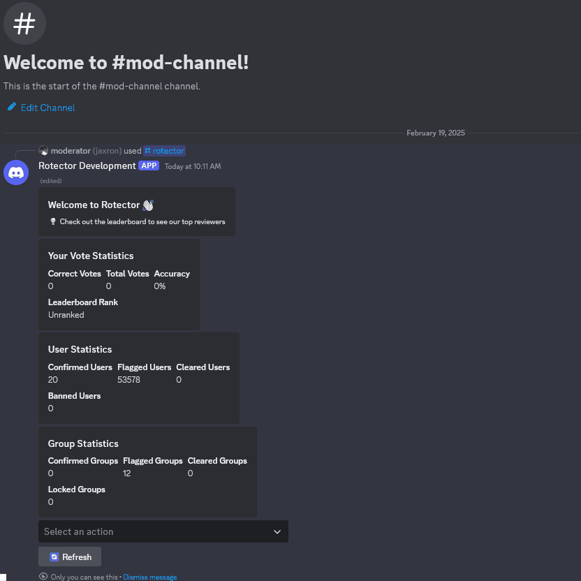

Moderators can quickly look up and review specific users or groups by providing their ID/UUID, allowing for targeted investigation of flagged accounts.
                 |

<em>...and so much more to come!</em>

## 📦 Prerequisites

> [!WARNING]
> This tool requires significant resources and technical expertise to run properly. It is not recommended for casual users without the necessary infrastructure.

### Essential

- [Go](https://go.dev/) 1.24 and above
- [PostgreSQL](https://www.postgresql.org/) 17.2 (with [TimescaleDB](https://www.timescale.com/) 2.17.X extension)
- [DragonflyDB](https://dragonflydb.io/) 1.25.X
- [Google AI Studio](https://aistudio.google.com/) Paid API key (uses [Gemini 2.0 Flash](https://ai.google.dev/gemini-api/docs/models/gemini#gemini-2.0-flash) by default)
- Proxy lists:
  - HTTP proxies for API requests (recommended 60-80 per worker)
  - HTTP proxies for [Roverse](https://github.com/robalyx/roverse)  in different locations to leverage Cloudflare's edge network
- [.ROBLOSECURITY](https://roblox.fandom.com/wiki/.ROBLOSECURITY) Cookie (for lower rate limits)
- Initial set of confirmed inappropriate accounts (minimum 100 recommended)
- Discord bot token
- Discord user token

### Developer Tools

- [Just](https://github.com/casey/just) (command runner for development tasks)
- [Docker](https://www.docker.com/) or [Podman](https://podman.io/) (container runtime)
- [Dagger](https://dagger.io/) (CI/CD pipeline tool)

### Optional

- [Uptrace](https://uptrace.dev/) (recommended for production)
- [Roverse](https://github.com/robalyx/roverse) proxy (fallback to offload requests)

## 📚 Guides

> [!NOTE]
> We do not provide public documentation to prevent misuse. However, developers can copy the `config` directory to `.rotector` and modify the configuration files as needed. For deployment instructions, refer to the `justfile` which contains commands for building and deploying using Dagger.

Detailed guides for moderators will be available during the beta phase. Stay tuned!

## ⚡ Efficiency

Rotector is built to efficiently handle large amounts of data while keeping resource usage at a reasonable level. Here's a performance snapshot from one of our test runs on a shared VPS:

> [!NOTE]
> These results should be viewed as illustrative rather than definitive. Performance can vary significantly due to various factors such as API response times, proxy performance, system resources, configuration, and more. Not all of the VPS resources were used.

### Test Environment

#### VPS Specifications

- OS: Ubuntu 24.04
- CPU: Intel Xeon Gold 6150 with 8 vCores @ 2.693GHz
- RAM: 24 GB
- Network: 1 Gbit/s

#### Test Configuration

- Time Given: 8 hours
- Starting Users: 100
- Starting Groups: 10
- Workers:
  - 5 friend workers
  - 3 group workers
  - 1 maintenance worker
- Proxies:
  - 600 shared proxies
  - 0 roverse proxies

### Test Results

| Metric                                     | Current Run |
|--------------------------------------------|-------------|
| **Users Flagged (*c* >= 0.1 & *c* < 0.4)** | **41**      |
| **Users Flagged (*c* >= 0.4 & *c* < 0.6)** | **12,259**  |
| **Users Flagged (*c* >= 0.6 & *c* < 0.8)** | **27,559**  |
| **Users Flagged (*c* >= 0.8)**             | **13,739**  |
| Estimated Cost                             | < $50       |

> - **c** in the metrics refers to the confidence threshold for flagging users.

### Test Analysis

#### User Detection

At the current rate, a 24-hour runtime would theoretically flag approximately **160,794 users**. However, the number of flagged users would probably be lower as more users are added to the database. If Rotector maintained this detection rate, it could potentially flag **more than a million inappropriate accounts in just a week**!

A brief analysis of the results shows that users flagged with **high confidence values** (c >= 0.8) were **all correctly identified inappropriate accounts, with virtually no false positives**. These high-confidence flags were **primarily based on direct evidence from user profiles**, including inappropriate usernames, descriptions, and other profile content.

Users flagged in the **0.6 to 0.8 confidence range** showed increased false positives, particularly for vague or borderline content. While many accounts in this range were still correctly identified, moderators would need to review these cases more carefully.

The **0.1 to 0.6 confidence range** had the lowest accuracy rate, with a larger number of false flags, which were often triggered by ambiguous content that could be interpreted multiple ways.

#### Group Detection

While the system tracked numerous groups containing large numbers of flagged users, **only 11 groups met the strict flagging criteria** during the test period. This conservative threshold was **intentionally set high to prevent false positives**. Had the test continued running, more groups would likely have been flagged as additional user data was collected.

Some notable examples of tracked groups include:

- Group with **2740** flagged users (65XXX97)
- Group with **2391** flagged users (34XXX172)
- Group with **1801** flagged users (53XXX61)
- Group with **1680** flagged users (35XXX907)
- Group with **1562** flagged users (34XXX172)
- Group with **1486** flagged users (35XXX031)
- ... and 5 more groups with hundreds of flagged users

Our detection algorithm also considers the **percentage of flagged users** in a group rather than just raw numbers. Through this method, we identified one smaller group with **556 flagged users**, which conventional moderation methods might normally overlook due to its size. This group was accurately flagged based on the high percentage of inappropriate accounts among its members. **All groups were accurately flagged with no false positives.**

#### Limitations and Scalability

The primary constraint on the system's performance is the **availability and cost of proxies**. These proxies are essential as our workers need to process users and gather all necessary data upfront, resulting in numerous requests per second. While this pre-loading approach enables moderators to get **near-instant access** to all user information without waiting for additional API requests, it requires substantial proxy resources.

Another significant factor is the **cost of AI processing** as AI analysis still represents a large portion of operational expenses. Despite evaluating other alternatives, **Gemini 2.0 Flash** currently offers the best price-to-performance ratio for our specific use case, making it the most practical choice for sustainable operation.

With additional proxies or an alternative method to get past rate limits, we could potentially achieve **10 times more users scanned per hour** with the current VPS resourcesdue to Rotector's performant architecture, but remains limited by these constraints.

## 🛠️ Community Tools

|                                                                                                                                                                                                        [Rotten - Official Export Checker](https://github.com/robalyx/rotten)                                                                                                                                                                                                        |                                                                                                                                                                                                    [Roscoe - Official REST API](https://github.com/robalyx/roscoe)                                                                                                                                                                                                    |
|:-----------------------------------------------------------------------------------------------------------------------------------------------------------------------------------------------------------------------------------------------------------------------------------------------------------------------------------------------------------------------------------------------------------------------------------------------------------------------------------:|:---------------------------------------------------------------------------------------------------------------------------------------------------------------------------------------------------------------------------------------------------------------------------------------------------------------------------------------------------------------------------------------------------------------------------------------------------------------------:|
| 

A simple command-line tool that lets you check Roblox accounts against Rotector exports. Easily verify individual users, groups, or scan entire friend lists for flagged accounts.

 | 

A globally-distributed REST API powered by Cloudflare Workers and D1. Efficiently stores and serves flagged users from edge locations worldwide for minimal latency.

 |

<em>Have you built a tool using Rotector's exports or database? Let us know!</em>

## ❓ FAQ

How can I trust that Rotector's analysis is accurate?

While **no automated system is perfect**, Rotector uses several measures to ensure high accuracy. **False positives are inevitable**, especially in borderline cases where content might be vague or open to interpretation which are typically flagged with lower confidence levels.

However, these false positives **don't affect the accuracy of future results**. We've implemented safeguards to prevent this - for example, when the friend worker processes connections, it will only scan the friends of users that were flagged with a **high confidence level of 0.8 or above**. This strict threshold helps ensure that only the most certain cases are used to expand our search. For confirmed inappropriate accounts that have been manually verified, this confidence threshold doesn't apply since we have human verification of their status.

The system's accuracy is also continuously monitored and improved through moderator feedback.

What's the story behind Rotector?

The journey began on September 23, 2024, when [jaxron](https://github.com/jaxron) developed two important libraries: [RoAPI.go](https://github.com/jaxron/roapi.go) and [axonet](https://github.com/jaxron/axonet). These libraries laid the foundation for what would become Rotector's core networking capabilities.

Rotector's development began on October 13, 2024, due to growing concerns about Roblox's lack of moderation and a desire to develop tools to protect young players. The project went public for alpha testing on November 8, 2024.

While Roblox already has moderators, the scale of the platform makes it hard to catch every inappropriate account. Even Roblox staff have acknowledged the difficulties in handling the reports they receive, sometimes leading to inappropriate content staying active even after reports.

Rotector aims to bridge this gap by automating the detection process, making moderation more efficient and helping create a safer environment for the Roblox community.

Why is Rotector open-sourced?

We believe in transparency and the power of open source. By making our code public, anyone can understand how the tool works and it's also a great way for people to learn about online safety and moderation tools.

If you're interested in contributing to the project, please reach out to us directly. We're always excited to collaborate with others who share our mission of making Roblox safer.

Why choose Gemini over other AI models?

After testing various AI models, we chose Gemini for its combination of performance and cost-effectiveness. These advantages allow us to process more content while maintaining high accuracy, making advanced features more accessible and ensuring the project's long-term sustainability.

Can I use Rotector without the Discord bot?

Yes, but the Discord bot makes reviewing accounts much easier. The main features (finding and flagging inappropriate accounts) work fine without Discord but you'll need to create your own way to review the accounts that get flagged. All flagged users and groups are stored in the `flagged_users` and `flagged_groups` tables in the database.

Why use Discord instead of a custom web interface?

Discord already has everything we need for reviewing accounts - buttons, dropdowns, forms, and rich embeds. Using Discord lets us focus on making Rotector better instead of building a whole new interface from scratch.

Are proxies and cookies necessary to use Rotector?

Both proxies and cookies are required as Rotector makes lots of requests per second. To control the rate of requests, the `config.toml` file includes cooldown settings for each endpoint.

Will users who have stopped their inappropriate behavior be removed from the database?

No, confirmed and flagged users remain in the database permanently, even if they're banned or claim to have changed. This data retention helps track patterns of behavior and can be valuable for law enforcement investigations or identifying repeat offenders who create new accounts.

The Rotector team is not responsible for any privacy law compliance - this responsibility falls entirely on the entities running their own instances of the software.

Who inspired the creation of Rotector?

[Ruben Sim](https://www.youtube.com/@RubenSim), a YouTuber and former game developer, helped inspire Rotector. His work exposing Roblox's moderation problems, especially through the [Moderation for Dummies](https://x.com/ModForDummies) Twitter account, showed what one person could do even without special tools. We are deeply grateful for his contributions which helped pave the way for our project.

## 👥 Contributing

We follow the [Contributor Covenant](CODE_OF_CONDUCT.md) Code of Conduct. If you're interested in contributing to this project, please abide by its terms.

## 📄 License

This project is licensed under the GNU General Public License v2.0 - see the [LICENSE](LICENSE) file for details.

## ⚠️ Disclaimer

Roblox is a registered trademark of Roblox Corporation. "Rotector" and the Rotector logo are not affiliated with, endorsed by, or sponsored by Roblox Corporation.

Rotector is free software: you can redistribute it under the terms of the GNU General Public License version 2 as published by the Free Software Foundation. You may modify the software for your own use. If you distribute modified versions, you must do so under the same GPL v2 license and make the source code of your modifications available.

### Terms of Service Compliance

While Rotector only accesses publicly available information through Roblox's API, users should be aware that:

- This tool should not be used to harass or target specific users
- Any automated scanning and excessive requests may violate Roblox's Terms of Service
- Users are responsible for ensuring compliance with all applicable privacy laws and regulations in their jurisdiction when using this software

---

  🚀 <strong>Powered by modern technologies.</strong>

