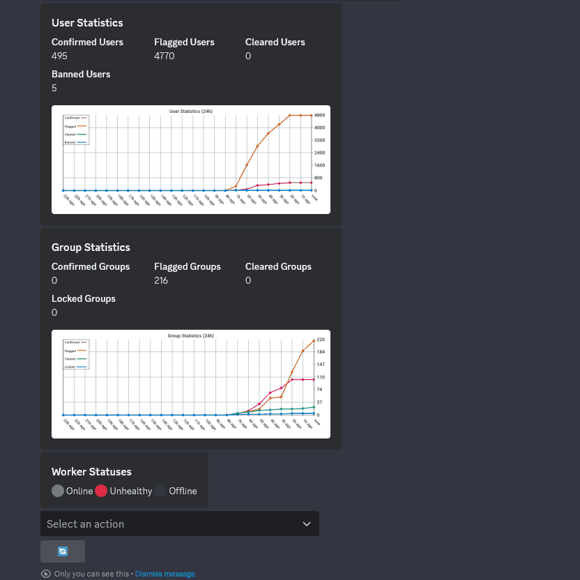
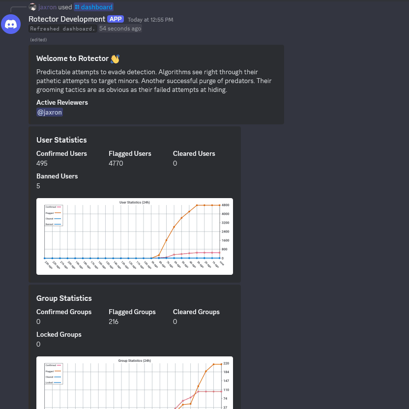
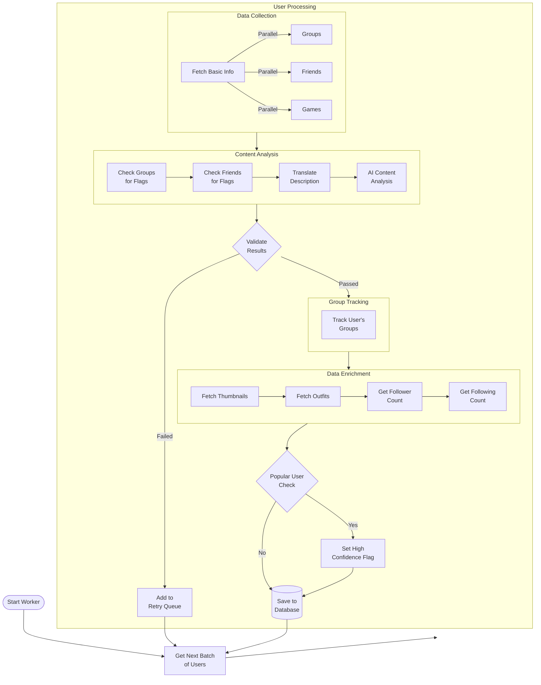
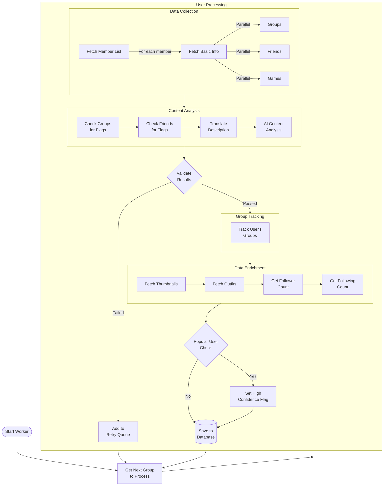
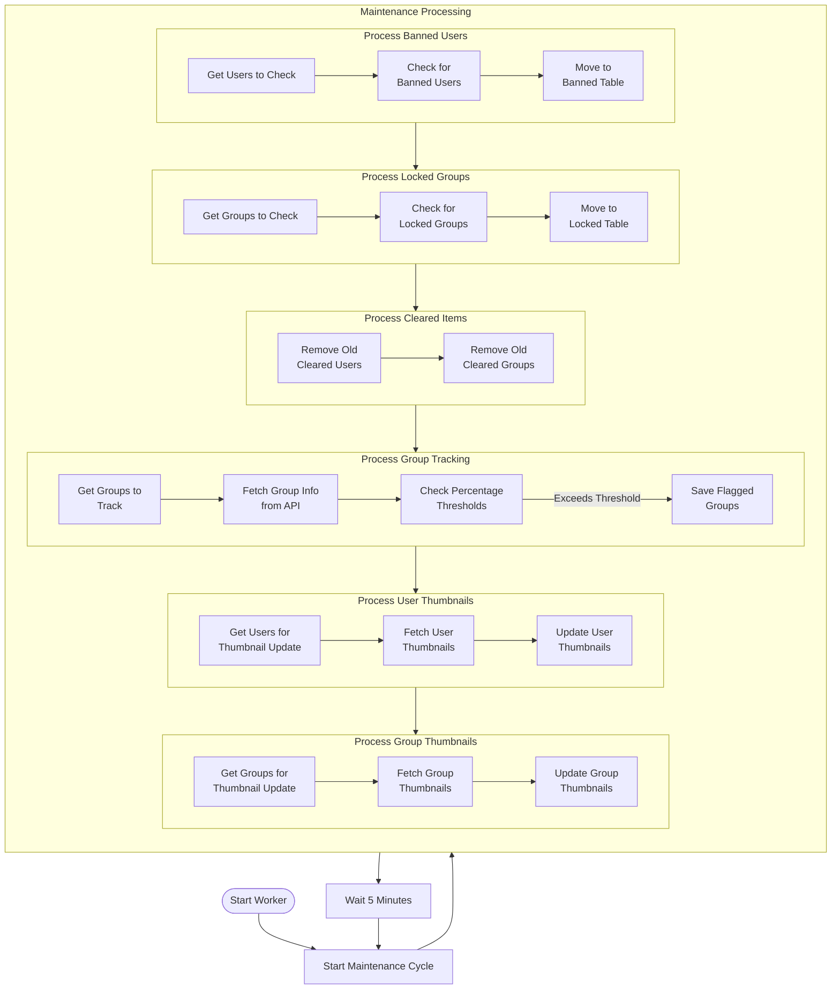
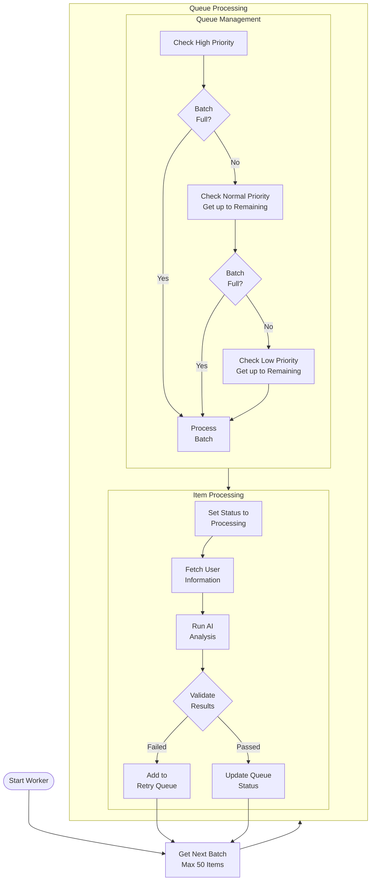
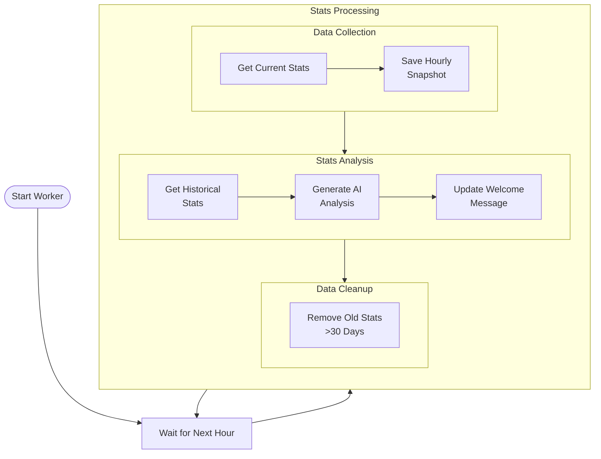
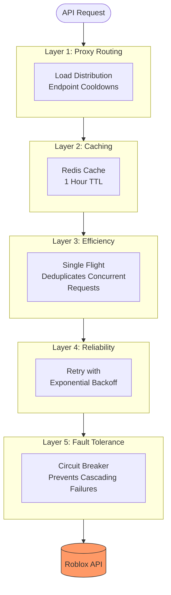
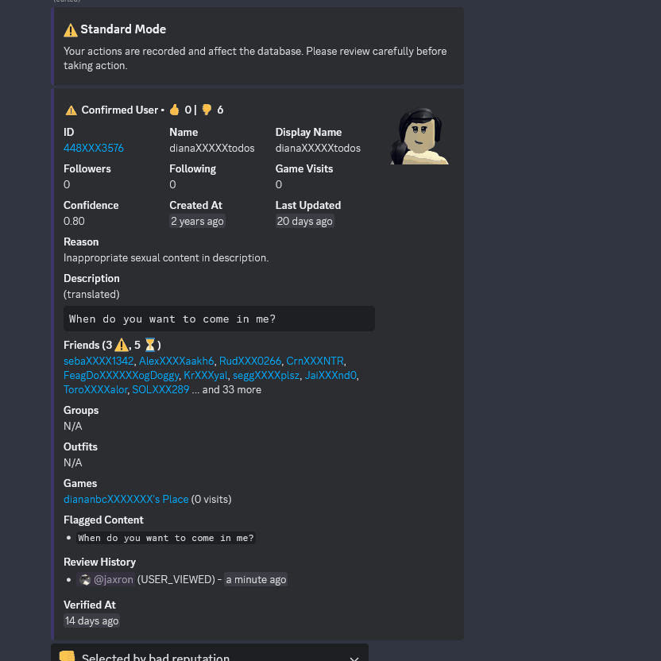

<h1 align="center">
  <picture>
    
  </picture>
   
  
  
  
  
</h1>

  <em>When Roblox moderators dream of superpowers, they dream of <b>Rotector</b>. A powerful application built with <a href="https://go.dev/">Go</a> that uses AI and smart algorithms to find inappropriate Roblox accounts.</em>

---

> [!IMPORTANT]
> This project is currently in an **ALPHA** state with frequent breaking changes - **do not use this in production yet**. This is a **community-driven initiative** and is not affiliated with, endorsed by, or sponsored by Roblox Corporation. More details in the [Disclaimer](#%EF%B8%8F-disclaimer) section.

  👀 <strong>beta is coming...</strong>

---

## 📚 Table of Contents

- [🚀 Features](#-features)
- [📦 Prerequisites](#-prerequisites)
- [🔄 Architecture](#-architecture)
- [⚡ Efficiency](#-efficiency)
- [🔄 Reviewing](#-reviewing)
- [🛣️ Roadmap](#️-roadmap)
- [❓ FAQ](#-faq)
- [👥 Contributing](#-contributing)
- [📄 License](#-license)
- [⚠️ Disclaimer](#%EF%B8%8F-disclaimer)

## 🚀 Features

|                                                                                                                                                         Fast AI-Assisted Workflow                                                                                                                                                         |                                                                                                                          In-Depth User Investigation                                                                                                                          |
|:-----------------------------------------------------------------------------------------------------------------------------------------------------------------------------------------------------------------------------------------------------------------------------------------------------------------------------------------:|:-----------------------------------------------------------------------------------------------------------------------------------------------------------------------------------------------------------------------------------------------------------------------------:|
|                                       

Easily review flagged accounts within seconds with the help of AI and an overview of profile details and violations, helping moderators make smart decisions.
                                       |                         

Moderators can easily explore a user's outfits, friends, and groups, providing an understanding of the user's activity.
                          |
|                                                                                                                                                         Multi-Format Translation                                                                                                                                                          |                                                                                                                             Activity Log Browser                                                                                                                              |
|                    

The review menu features translation capabilities, supporting natural languages, morse code, and binary, which ensures effective review of content across different languages and encodings.
                     | 

The log browser allows administrators to make detailed queries of moderation actions based on specific users, actions, or date ranges, which provides detailed audit trails.
  |
|                                                                                                                                                               Streamer Mode                                                                                                                                                               |                                                                                                                          Session State Preservation                                                                                                                           |
| 

Streamer mode provides additional privacy by censoring sensitive user information in the review menu. This feature is particularly useful for content creators and moderators who want to use the tool while maintaining confidentiality.
 | 

With our modern infrastructure, review sessions are preserved across channels and servers, allowing moderators to seamlessly resume their work from where they left off.
 |
|                                                                                                                                                               Training Mode                                                                                                                                                               |                                                                                                                                 Review Modes                                                                                                                                  |
|                      

Non-official moderators in the community can participate by upvoting/downvoting based on whether they think an account breaks the rules, helping to point out accounts that need urgent review.
                      |            

Moderators can switch between Standard Mode (ban/clear) and Review mode (downvote/upvote), and also switch between reviewing Flagged and Confirmed users.
            |
|                                                                                                                                                             User Queue System                                                                                                                                                             |                                                                                                                                 Recheck Users                                                                                                                                 |
|                                                  

Want to manually check a specific user? Users can be added to priority queues for processing by workers to check for potential violations.
                                                  |                                  

Users can be rechecked if analysis is wrong or the user information is outdated right from the review menu.
                                  |
|                                                                                                                                                               Appeal System                                                                                                                                                               |                                                                                                                               User/Group Lookup                                                                                                                               |
|          

Users can appeal flagged accounts through an intuitive ticket system. The automated verification process ensures legitimate appeals, and moderators can efficiently process appeals with simple accept/reject actions.
           |            

Moderators can quickly look up and review specific users or groups by providing their ID/UUID, allowing for targeted investigation of flagged accounts.
            |
|                                                                                                                                                         Live Statistics Dashboard                                                                                                                                                         |                                                                                                                            AI Moderation Assistant                                                                                                                            |
|                             

The dashboard displays live hourly statistics showing an AI-generated analysis message, active reviewers, active workers, and various statistics for real-time performance tracking.
                              |                      

Moderators can use an AI assistant to get guidance on moderation decisions, analyze user behavior patterns, and receive recommendations.
                       |

<em>...and so much more to come!</em>

## 📦 Prerequisites

> [!WARNING]
> This tool requires significant resources and technical expertise to run properly. It is not recommended for casual users without the necessary infrastructure.

### Essential

- [Go](https://go.dev/) 1.23.X
- [PostgreSQL](https://www.postgresql.org/) 17.2 (with [TimescaleDB](https://www.timescale.com/) 2.17.1 extension)
- [DragonflyDB](https://dragonflydb.io/) 1.25.X or [Redis](https://redis.io/) 7.4.X
- [Google AI Studio](https://aistudio.google.com/) Paid API key (uses [Gemini 1.5 Flash-8B](https://ai.google.dev/gemini-api/docs/models/gemini#gemini-1.5-flash-8b) by default)
- Proxies to avoid rate limits (recommended 40 per worker)
- Discord Bot token

### Optional

- [GlitchTip](https://glitchtip.com/), [Uptrace](https://uptrace.dev/), or [Sentry](https://sentry.io) (recommended for production)
- Cookies: Not necessary at this time

## 🔄 Architecture

Rotector uses a multi-worker system to process and analyze Roblox accounts efficiently, with each type of worker responsible for different parts of the detection and maintenance processes.

> [!TIP]
> Interested in seeing how well it performs? Check out our test results in the [Efficiency](#-efficiency) section.

### Workers

AI Friend Worker

The AI friend worker systematically analyzes user networks to identify inappropriate content and behavior patterns. Here's how it works:

The worker continuously processes users in batches, with built-in safeguards:

- Pauses when flagged user count exceeds threshold
- Validates AI results against original content
- Maintains retry queue for failed validations
- Enriches flagged users with additional data for review

Going into more detail about the detection process:

1. **Smart Scoring**:
   We analyze multiple factors including friend networks, group memberships, and account information to identify patterns of inappropriate content. Our system is tuned to catch both clear and subtle violations while minimizing false positives.

2. **AI Analysis**:
   Our AI only flags accounts with evidence of violations. While this means some borderline cases might be missed, it ensures high confidence in flagged accounts.

3. **Validation System**:
   When the AI flags content, we validate that it exists on the user's profile. This extra verification step helps prevent false positives and maintains system reliability.

What We Don't Flag:

- Accounts just for having only one flagged friend/follower
- Normal friendship conversations
- Regular emojis or internet slang
- Art without inappropriate themes
- Gender/orientation discussions
- Normal roleplay activities
- Regular bad language (handled by Roblox filters)

AI Group Worker

The AI group worker analyzes group member lists to identify inappropriate accounts. Here's how it works:

The key difference from the friend worker is that it:

- Processes members from inappropriate groups
- Uses cursor pagination to handle large member lists

Going into more detail about the detection process:

1. **Group Analysis**:
   The system tracks the groups each flagged user is in. For the groups that exceed a certain threshold of flagged members, they are flagged for review.

2. **False Positives**:
   Large groups like fan groups may be flagged due to their member count. After manual review, cleared groups are whitelisted to prevent future flags, though administrators can reverse this status if needed.

Maintenance Worker

The maintenance worker maintains database hygiene by cleaning up old data, checking for banned/locked accounts, and flagging groups:

The worker continuously:

- Checks for and removes banned users
- Checks for and removes locked groups
- Purges old cleared users/groups
- Flag groups with flagged users
- Runs every 1 minute

Queue Worker

The queue worker processes user verification requests from different priority queues:

The worker:

- Processes items in priority order (High → Normal → Low)
- Updates queue status for tracking
- Handles validation failures with retries
- Runs continuously with smart batching

Stats Worker

The stats worker collects and processes statistical data for analysis:

The worker:

- Runs hourly statistical snapshots
- Generates AI analysis of trends
- Updates welcome messages
- Cleans up old data

### Requests

Middleware Layers

Rotector uses a sophisticated middleware chain to ensure reliable and efficient API interactions. Here's how requests are processed:

Each layer serves a specific purpose:

1. **Proxy Routing** (Layer 1)
   - Distributes requests across multiple proxies
   - Manages endpoint-specific cooldowns per proxy
   - Helps avoid IP-based rate limits

2. **Redis Caching** (Layer 2)
   - Caches responses for 1 hour
   - Reduces load on Roblox API
   - Improves response times

3. **Request Deduplication** (Layer 3)
   - Combines identical concurrent requests
   - Reduces unnecessary API calls
   - Uses Go's singleflight pattern

4. **Retry Logic** (Layer 4)
   - Handles transient failures
   - Uses exponential backoff
   - Configurable retry limits

5. **Circuit Breaker** (Layer 5)
   - Prevents cascading failures
   - Automatic recovery after timeout
   - Configurable failure thresholds

The middleware chain processes requests, with each middleware layer adding its optimization, which ensures maximum efficiency while maintaining reliability.

## ⚡ Efficiency

Rotector is built to efficiently handle large amounts of data while keeping resource usage at a reasonable level. Here's a performance snapshot from one of our test runs on a shared VPS:

> [!NOTE]
> These results should be viewed as illustrative rather than definitive. Performance can vary significantly due to various factors such as API response times, proxy performance, system resources, configuration, and more. Not all of the VPS resources were used.

### Test Environment

#### VPS Specifications

- OS: Ubuntu 24.04
- CPU: Intel Xeon Gold 6150 with 8 vCores @ 2.693GHz
- RAM: 24 GB
- Network: 1 Gbit/s
- Location: Germany

#### Test Configuration

- Version: [`bd7281c`](https://github.com/robalyx/rotector/commit/bd7281c2f08e23baf5595d437e47aa3f9d65846d)
- Time Given: 1 hour
- Workers: 15 AI friend workers, 5 maintenance workers
- Proxies: 500 shared proxies

### Test Metrics

| Metric                   | Current Run | Previous Run |
|--------------------------|-------------|--------------|
| Users Scanned            | 740         | 1,001        |
| **Users Flagged**        | **12,427**  | **14,800**   |
| **Groups Flagged**       | **95**      | **167**      |
| Requests Sent            | 79,082      | 300,195      |
| Bandwidth Used           | 932.09 MB   | 2.83 GB      |
| Avg Concurrent Requests  | 653         | 1,060        |
| Avg Requests Per Second  | 6           | 12           |
| Avg Bandwith Per Request | 12.07 KB    | 9.88 KB      |
| AI Cost                  | **$0.16**   | **$0.07**    |
| AI Calls (CT)            | 17,845      | 13,089       |
| AI Calls (GC)            | 6,158       | 5,720        |
| AI Latency (CT)          | ~0.017s     | ~0.017s      |
| AI Latency (GC)          | ~1.265s     | ~1.038s      |
| Redis Memory Usage       | 1.48 GB     | 702.62 MB    |
| Redis Key Count          | 385,700     | 204,172      |

> [!NOTE]
> **CT** and **GC** in the metrics refer to _CountTokens_ and _GenerateContent_ calls to the Gemini API respectively.

### Test Analysis

#### User Detection

At the current rate, a 24-hour runtime would theoretically flag approximately **298,248 users**, with AI costing only **$3.84**. However, the number of flagged users would probably be lower as more users are added to the database. If Rotector maintained this detection rate, it could potentially flag **hundreds of thousands of inappropriate accounts in just a week**!

A brief analysis of the results shows that almost all users were flagged accurately, with some false positives, which is to be expected. These false positives are borderline cases or too vague to be considered inappropriate.

#### Group Detection

We discovered several large groups of inappropriate accounts that have managed to avoid detection by traditional moderation techniques:

- Group with 1934 flagged users (34XXXX55)
- Group with 1719 flagged users (45XXXX3)
- Group with 1680 flagged users (34XXXX41)
- Group with 1521 flagged users (65XXXX7)
- Group with 1401 flagged users (34XXXX64)
- Group with 1063 flagged users (35XXXX31)
- ... and many more with hundreds of flagged users

Smaller groups have also been identified by our detection algorithm, which also considers the percentage of flagged users in a group instead of just raw numbers. This includes small ERP communities and pools of alt account that conventional moderation methods might normally overlook. **All groups were accurately flagged with no false positives.**

#### Comparison with Previous Run

The current run displays fewer users and groups flagged compared to the previous run, which was expected as improvements were made to the detection algorithm and resulted in fewer false positives.

We've also made significant improvements to the networking side. With optimizations in request patterns and strategies, the current run used only roughly a third of the bandwidth compared to the previous run (932.09 MB vs 2.83 GB).

These results are constantly getting better as we improve the detection algorithm and networking side. However, the biggest limitation is the number of proxies available due to their high costs. These proxies are necessary as workers need to process users and gather all necessary data upfront which makes many requests per second. This pre-loading approach means that when moderators review flagged accounts, they get near-instant access to all user information without waiting for additional API requests.

With more proxies or even a special way to get past rate limits, we could potentially scan over 100 times more users per hour instead of the current rate given the current VPS resources. This would theoretically be possible as Rotector is built with performance in mind.

## 🔄 Reviewing

Rotector has two methods for reviewing flagged accounts: one designed for community members and another for official moderators. This dual approach promotes community involvement while allowing official moderators to handle the final decisions.

### Community Review Mode (Training Mode)

Anyone can assist in reviewing flagged accounts through a specially designed Training Mode. To ensure confidentiality, this mode censors user information and hides external links. Anyone can participate by upvoting/downvoting based on their assessment of whether an account violates the rules, which helps point out accounts that need urgent review by official moderators.

This system helps official moderators in several ways:

- Finds the most serious cases quickly
- Gives moderators extra input for their decisions
- Helps train new moderators

### Official Review Mode (Standard Mode)

Official moderators have better tools and permissions for reviewing accounts. They are able to:

- Access all account information (unless they turn on streamer mode)
- Request workers to recheck accounts
- View logs of all moderation activities
- Toggle between standard mode and training mode
- Make changes to the database

What sets this mode apart is that moderators have the authority to take all necessary actions regarding flagged accounts. While community votes provide input, it is the moderators who ultimately decide the fate of these accounts.

## 🛣️ Roadmap

This roadmap shows our major upcoming features, but we've got even more in the works! We're always adding new features based on what the community suggests.

- 👥 **Moderation Tools**

  - [X] Appeal process system
  - [ ] Inventory viewer

- 🔍 **Scanning Capabilities**

  - [ ] Group content detection (wall posts, names, descriptions)

- 🌐 **Public API** (Available in Beta)
  - [ ] RPC/REST API for developers to integrate with
  - [ ] Script for Roblox game developers to integrate with

## ❓ FAQ

How do I set this up myself?

Detailed setup instructions will be available during the beta phase when the codebase is more stable. During alpha, we're focusing on making frequent changes, which makes maintaining documentation difficult.

What's the story behind Rotector?

Rotector started when [jaxron](https://github.com/jaxron) developed two important libraries on September 23, 2024: [RoAPI.go](https://github.com/jaxron/roapi.go) and [axonet](https://github.com/jaxron/axonet) which became the backbone of Rotector's networking and API interaction capabilities.

Rotector's official development began secretly on October 13, 2024, due to his concerns about inappropriate behavior on Roblox and a desire to help protect young players. The project was made public for the alpha testing phase on November 8, 2024.

While Roblox already has moderators, there are so many users that it's hard to catch every inappropriate account easily. Some Roblox staff have also acknowledged that it's difficult to handle all the reports they get. Sometimes, inappropriate accounts and groups stay active even after being reported.

Rotector helps by finding these accounts automatically. Our goal is to make moderation easier and help keep the Roblox community, especially young players, safer.

Why is Rotector open-sourced?

We believe in transparency and the power of open source. By making our code public, anyone can understand how the tool works and it's also a great way for people to learn about online safety and moderation tools.

While we welcome feedback, ideas, and contributions, this open-source release is mainly to show how the tool works and help others learn from it.

Can I use Rotector without the Discord bot?

Yes, but the Discord bot makes reviewing accounts much easier. The main features (finding and flagging inappropriate accounts) work fine without Discord but you'll need to create your own way to review the accounts that get flagged. All flagged users and groups are stored in the `flagged_users` and `flagged_groups` tables in the database.

Why use Discord instead of a custom web interface?

Discord already has everything we need for reviewing accounts - buttons, dropdowns, forms, and rich embeds. Using Discord lets us focus on making Rotector better instead of building a whole new interface from scratch.

Are proxies and cookies necessary to use Rotector?

Proxies are required as Rotector makes lots of requests per second. While cookies are mentioned in the settings, we don't use them for anything at the moment.

The `config.toml` file includes cooldown settings for each endpoint that lets you control how many requests Rotector makes to Roblox's API.

Will users who have stopped their inappropriate behavior be removed from the database?

No, past rule violations remain in the database, even if users say they've changed. This can be useful for law enforcement investigations and for future safety concerns.

Some users try to clean up their profiles temporarily, only to return to breaking rules later. It isn't about preventing second chances but rather about keeping the platform safe, especially for young users.

Why did Rotector switch from GPT-4o mini to Gemini?

We made the switch to Gemini because it is 4 times cheaper than GPT-4o mini, offers 5 times faster output speed, and has 2 times lower latency, while maintaining the same level of accuracy in identifying inappropriate content. This change allows us to achieve more with a smaller budget, introduce new features that were previously unaffordable, and ensure the project's long-term sustainability.

Who inspired the creation of Rotector?

[Ruben Sim](https://www.youtube.com/@RubenSim), a YouTuber and former game developer, helped inspire Rotector. His work exposing Roblox's moderation problems, especially through the [Moderation for Dummies](https://x.com/ModForDummies) Twitter account, showed what one person could do even without special tools. We are deeply grateful for his contributions which helped pave the way for our project.

How did "Rotector" get its name?

The name comes from three ideas:

1. **Protector**: We want to protect Roblox players from inappropriate content
2. **Detector**: We find inappropriate accounts
3. **"Ro-" prefix**: From "Roblox", the platform we work with

## 👥 Contributing

We follow the [Contributor Covenant](CODE_OF_CONDUCT.md) Code of Conduct. If you're interested in contributing to this project, please abide by its terms.

If you're feeling extra supportive, you can always buy us a coffee! ☕

## 📄 License

This project is licensed under the GNU General Public License v2.0 - see the [LICENSE](LICENSE) file for details.

## ⚠️ Disclaimer

Roblox is a registered trademark of Roblox Corporation. "Rotector" and the Rotector logo are not affiliated with, endorsed by, or sponsored by Roblox Corporation.

Rotector is free software: you can redistribute it under the terms of the GNU General Public License version 2 as published by the Free Software Foundation. You may modify the software for your own use. If you distribute modified versions, you must do so under the same GPL v2 license and make the source code of your modifications available.

### Terms of Service Compliance

While Rotector only accesses publicly available information through Roblox's API, users should be aware that:

- This tool should not be used to harass or target specific users
- Any automated scanning and excessive requests may violate Roblox's Terms of Service
- Users are responsible for respecting the rate limit

---

  🚀 <strong>Powered by modern technologies.</strong>

