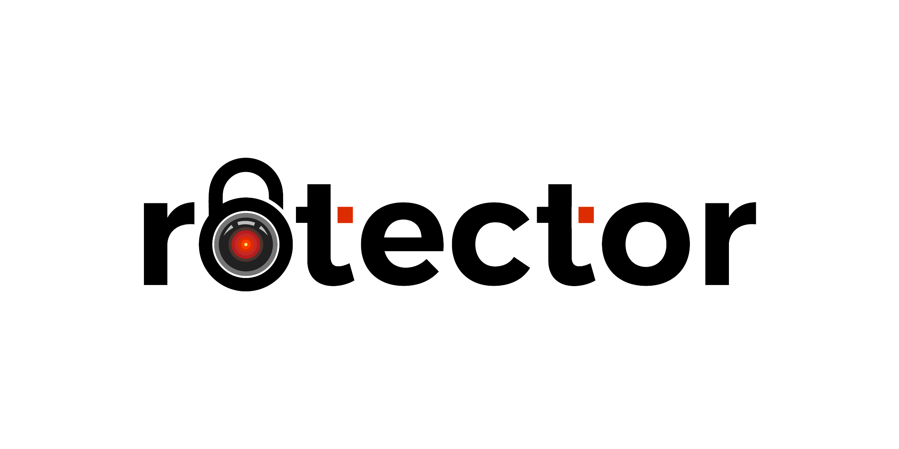
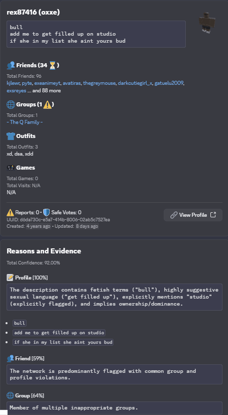

<h1 align="center">
  <picture>
    <source media="(prefers-color-scheme: dark)" srcset="./assets/png/banner-dark.png">
    <source media="(prefers-color-scheme: light)" srcset="./assets/png/banner-light.png">
    
  </picture>
   
  
  
  
  
  
</h1>

  <em>When Roblox and Discord moderators dream of superpowers, they dream of <b>Rotector</b>. A powerful system built with <a href="https://go.dev/">Go</a> that uses AI and smart algorithms to find inappropriate Roblox and Discord accounts.</em>

---

> [!WARNING]
> This project is open-sourced for version control and transparency only. **DO NOT** attempt to set up your own instance as the system requires significant technical expertise, infrastructure resources, and specific configurations to operate effectively. No support or guides are provided.

> [!IMPORTANT]
> This project is currently in an **ALPHA** state with frequent breaking changes - **do not use this in production yet**. This is a **community-driven initiative** and is not affiliated with, endorsed by, or sponsored by Roblox Corporation.

---

## 🔍 Showcase

  <em>See a sample of the types of users flagged by our AI system</em> 
  

Our detection system works through multiple layers of sophisticated analysis. Specialized workers continuously scan friend lists, groups, avatar outfits, user descriptions, and more to identify potentially inappropriate users. When the AI flags an account, it appears in our Discord bot interface where trained moderators conduct thorough reviews before confirming or clearing the flag.

This approach ensures high accuracy while minimizing false positives, and the system provides specialized tools for moderators to perform detailed checks, creating a powerful moderation workflow.

We're also developing an unreleased browser extension that will allow regular Roblox players to see if users they encounter have been flagged in our reviewed database. This extension will help the broader community identify potentially inappropriate accounts while browsing Roblox.

## ❓ FAQ

How can I trust that Rotector's analysis is accurate?

While Roblox uses AI systems for various moderation tasks like chat moderation, they often struggle with detecting serious issues in user profiles and behavior patterns. For example, their chat moderation system shows high false positive rates without human oversight, which is a problem we've learned from and specifically addressed in our profile analysis approach.

Through months of fine-tuning AI models, detection algorithms, and pattern recognition systems, we've achieved a high level of accuracy in analyzing user profiles and identifying inappropriate accounts.

However, like any automated system, false positives can still occur, particularly with borderline cases where content might be ambiguous or open to interpretation. These cases are typically flagged with lower confidence scores to indicate the need for careful review.

To address this, we have a feature-rich review system where our moderators carefully examine each flagged account through our Discord interface before making final decisions. This human oversight helps ensure that borderline cases are handled appropriately and prevents incorrect flags from affecting future results.

What are your plans for the database of reviewed users?

Our primary goal is to create transparency about the scale of inappropriate accounts on Roblox, especially given that it's marketed as a platform for children. We're developing a browser extension that will allow regular Roblox players to see if users they encounter have been flagged in our reviewed database, helping parents and players make informed decisions about interactions.

Unfortunately, Roblox Corporation has consistently downplayed the scale of this issue, which we believe puts children at risk. By making our findings accessible and transparent, we aim to demonstrate the true extent of the problem and encourage Roblox to take more decisive action to protect its young user base. Our project serves as both a protective tool and a call for accountability.

If Roblox administrators or relevant authorities need access to our complete database for legitimate safety purposes, we are more than willing to cooperate and provide the full, uncensored information directly.

How does the Roblox user detection system work?

The system operates through multiple sophisticated layers of detection and verification. At its core, specialized workers continuously scan friend lists and groups to identify potentially inappropriate users. These workers analyze various things including membership in inappropriate groups, connections to known inappropriate accounts, avatar outfits, condo game activities, and inappropriate user descriptions. We make use of AI and algorithms to flag accounts and generate reasons.

When users get flagged through these detection methods, they appear in the Discord bot interface where moderators can conduct thorough reviews. The bot provides specialized tools that allow moderators to perform checks before deciding whether to confirm or clear the flag.

The system also includes an API service called [roscoe](https://github.com/robalyx/roscoe) that developers can integrate with their own applications to check user flags. Additionally, we're developing a browser extension that will allow regular Roblox players to see if users they encounter have been flagged in our reviewed database, helping the broader community identify potentially inappropriate accounts while browsing Roblox.

Rotector focuses on identifying and tracking inappropriate accounts, while leaving the actual account moderation and termination decisions to Roblox. Roblox administrators would need to contact us directly to access the uncensored list.

How does the Discord user detection system work?

Our worker uses undocumented Discord endpoints to scan through all active members of Discord condo servers. We also perform periodic full user scans that allow us to discover every condo server a user is participating in, which helps us maintain an accurate database of user activities .

Server administrators can add the Discord bot into their Discord servers and access guild owner tools through the dashboard. They have two primary moderation options: banning users based on inappropriate server membership or banning users based on inappropriate message content. We strongly recommend the latter.

We specifically advise against banning users solely based on server membership due to the high risk of affecting innocent users. While we do have filters in place like minimum guild counts and minimum join time requirements to improve accuracy, this method can still affect investigators, reporters, non-participating members, compromised accounts, and those who joined through misleading invites. However, we have measurements that only flag users for server membership if they've been present in a condo server for more than 12 hours or have communicated in the server.

Our recommended method which uses an AI system actively analyzes messages sent in these condo servers by examining the full conversation context and user behavior. This approach focuses on actual inappropriate activity rather than making assumptions, providing a much more accurate and fair solution to the moderation challenge compared to systems that rely solely on server membership. This approach differentiates us from systems like Ruben's Ro-Cleaner bot.

How does Rotector handle privacy laws and data protection?

We take privacy laws and data protection regulations very seriously, setting us apart from other similar initiatives. While we keep historical data of user profiles even after updates for tracking behavior patterns, we have a way to comply with various privacy regulations including GDPR (European Union) and CCPA (California).

Our appeal system serves multiple purposes. Not only can users appeal their flagged account(s), they can also request data deletion, access their stored information, or request an update of their records.

When a data deletion request is received through the appeal system, we carefully validate the request and process it according to the applicable privacy law requirements. However, we may retain certain minimal information if required by law or legitimate interest, such as maintaining records of dangerous offenders.

What AI models does Rotector use?

Rotector uses the [official OpenAI library](https://github.com/openai/openai-go) for its AI capabilities, which means it can work with any OpenAI-compatible API service like [OpenRouter](https://openrouter.ai/) or [Requesty](https://www.requesty.ai/). While we use Gemini 2.0 Flash by default due to its excellent price-to-performance ratio, you have the flexibility to use any compatible model available through these services.

Does Rotector target the furry community?

No. Unlike some other initiatives that incorrectly associate the entire furry community with inappropriate behavior, Rotector strictly focuses on actual inappropriate content and behavior patterns. This kind of prejudiced targeting not only discriminates against innocent users but also undermines the real purpose of protecting users from real threats.

We believe that blanket targeting of any community is both harmful and ineffective. Our system evaluates specific behaviors and content that violate platform policies, not personal interests or community affiliation. This approach allows us to be more accurate in identifying actual inappropriate accounts while avoiding false positives based on  assumptions.

Why was Go chosen over Python or JavaScript?

A small prototype of Rotector was actually built in JavaScript several months before the project officially started. While it worked for testing basic concepts, we quickly hit limitations when trying to process thousands of accounts efficiently as it would slow down significantly due to its single threaded nature.

Go was the perfect solution to these challenges. It's incredibly good at running thousands of concurrent tasks (called goroutines) that are far more lightweight and efficient than Python's threads or JavaScript's async/await. These goroutines allow us to process massive amounts of data while using significantly less memory and CPU resources.

Go's built-in type system also provides compile-time safety without the overhead of TypeScript's runtime checks. While TypeScript offers similar features, Go's native implementation means faster execution and better performance. The compiler catches potential issues before deployment, making the system more reliable in production.

Another huge advantage is Go's code generation capabilities. Instead of writing hundreds of lines of repetitive code by hand for things like our session management system, Go generates it automatically, making the code cleaner and more reliable.

Go's superior memory management with minimal garbage collection pauses, fast compilation times, and single binary deployments also make it ideal for our large-scale system. Its standard library provides everything we need without relying heavily on external dependencies.

Why use Discord instead of a custom web interface?

Discord already has everything we need for reviewing accounts like buttons, dropdowns, forms, and rich embeds. Using Discord lets us focus on making Rotector better instead of building a whole new website interface from scratch.

Will users who have stopped their inappropriate behavior be removed from the database?

No, confirmed and flagged users remain in the database permanently, even if they're banned or claim to have changed. This data retention helps track patterns of behavior and can be valuable for law enforcement investigations or identifying repeat offenders.

We have a system in place to manage privacy laws. While users can request their data to be deleted through our appeal system in accordance with privacy regulations like GDPR and CCPA, their flag status will remain in our database regardless.

What's the story behind Rotector?

While many community initiatives have made valiant efforts to address Roblox's safety concerns, they've often been limited by technical expertise and resource constraints. Despite initially believing it was impossible for a single person to tackle such a massive platform-wide issue affecting millions of users, [jaxron](https://github.com/jaxron) took the first step by developing Rotector's initial prototype on October 13, 2024, driven by growing concerns about Roblox's moderation challenges and a desire to protect young players.

The foundation for this project was laid a few weeks earlier when jaxron developed two crucial libraries: [RoAPI.go](https://github.com/jaxron/roapi.go) and [axonet](https://github.com/jaxron/axonet) on September 23, 2024, which would become Rotector's core networking capabilities. The project went public for alpha testing on November 8, 2024.

While Roblox already has moderators, the scale of the platform makes it hard to catch every inappropriate account. Even Roblox staff have acknowledged the difficulties in handling the reports they receive, sometimes leading to inappropriate content staying active even after reports.

Rotector aims to bridge this gap by automating the detection process, making moderation more efficient and helping create a safer environment for the Roblox community. The story is still being written, and we're excited about the upcoming release.

## 📄 License

This project is licensed under the GNU General Public License v2.0 - see the [LICENSE](LICENSE) file for details.

---

  🚀 <strong>Protection at scale, when others fail.</strong>

